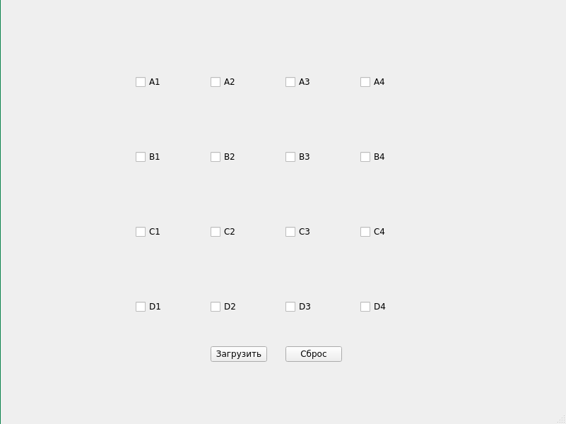
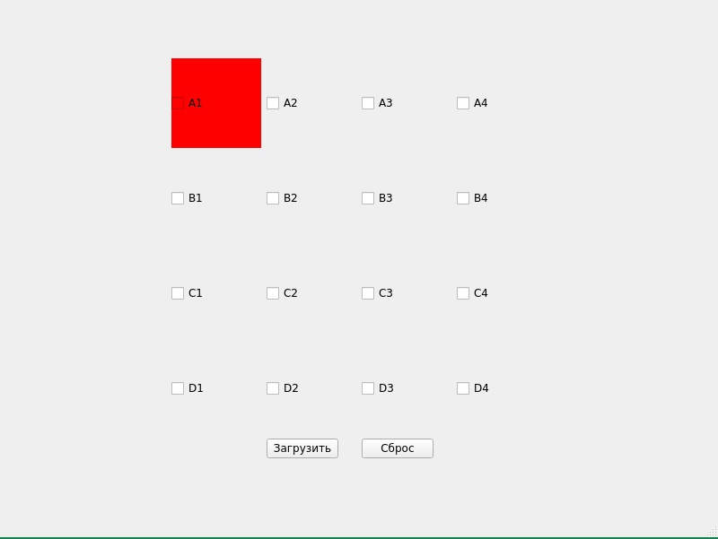
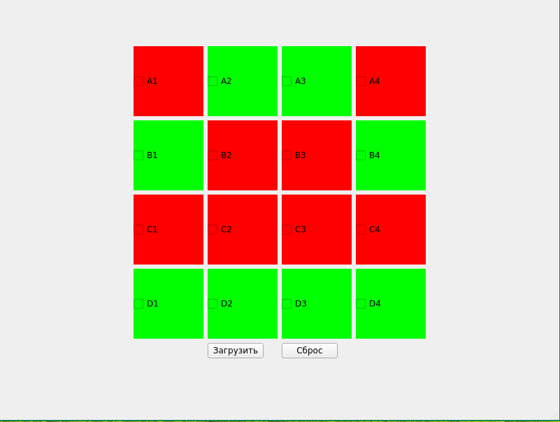

# 221_329_Kolesnikov

## Описание

Данный репозиторий содержит код для экзамена по дисциплине Методы и средства криптографической защиты информации. В данном репозитории находится код программы-игры с защитой сохранений кодов с помощью технологии блокчейн. Для сохранения информации использовался алгоритм шифрования AES256 и библиотека openssl. Расшифрованный файл сохранений состоит из наборов из 4 строк - координат хода, времени и хэша.

Игровое поле состоит из 16 чекбоксов, расположенных в решетке 4 на 4. При нажатии на чекбоксы им задается цвет, красный или зеленый, в зависимости от того, четный или нечетный ход. 

При нажатии на кнопку "Загрузить" считывается и расшифровывается содержимое файла record.txt. Если файла нет, то он создается. Содержимое файла проверяется, если вычисляемые хэши не совпадают, появляется сообщение об ошибке.

При нажатии на кнопку "Очистить" состояние программы сбрасывается, все клетки игрового поля очищаются.

После каждого хода в файл record.txt добавляются 4 строки текущего хода.

## Снимки

Рис 1. - Пустое игровое поле

Рис 2. - Игровое поле после 1 шага

Рис 3. - Заполненное игровое поле

